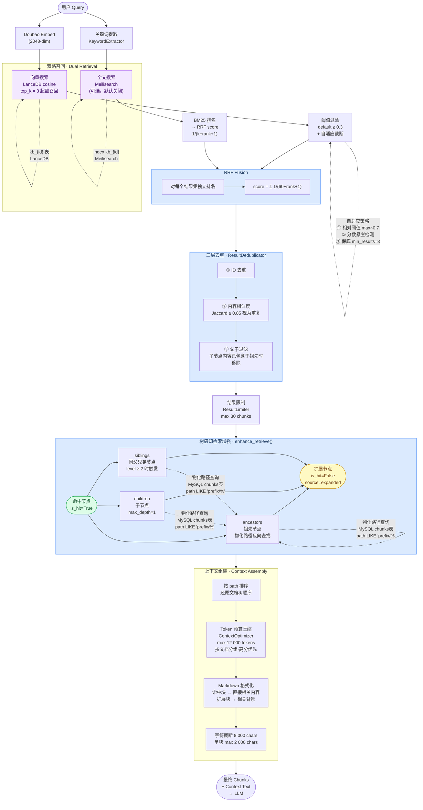

# RAG Search Logic

## 关键设计点速查

| 步骤 | 设计决策 | 参数 |
|------|---------|------|
| **超额召回** | 向量召回 `top_k × 3`，阈值后再截断到 top_k | 默认 top_k=5 |
| **自适应阈值** | 根据分数分布动态调整，避免固定阈值截断过多/过少 | base=0.3 |
| **RRF 融合** | 不依赖原始分数量纲，两路结果可直接合并排名 | k=60 |
| **内容去重** | Jaccard 词级相似度，短文本跳过（< 50 chars） | ≥ 0.85 |
| **父子过滤** | 物化路径判断，子集内容不重复出现 | 路径前缀匹配 |
| **树感知增强** | 命中节点带出上下文邻居，补充 LLM 所需背景 | siblings+children |
| **Token 预算** | 按文档分组、高分优先裁剪，保证 prompt 不超限 | 12 000 tokens |
