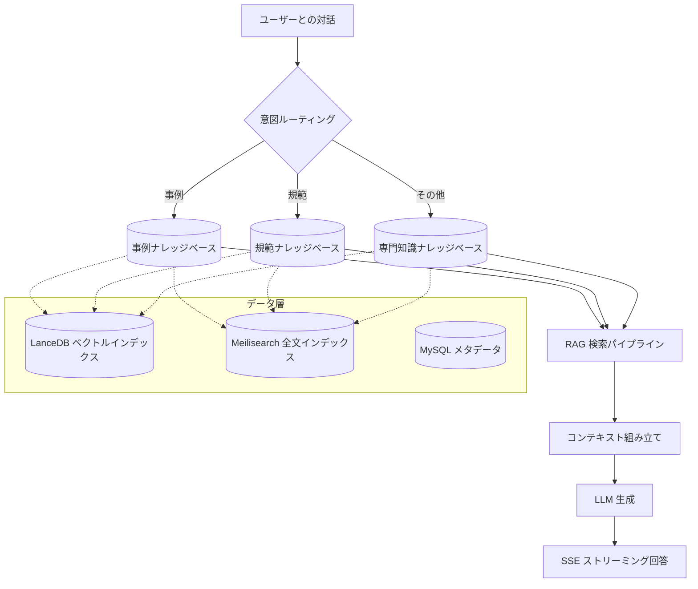
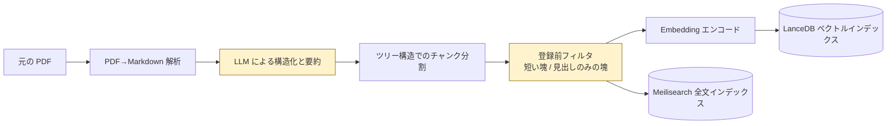
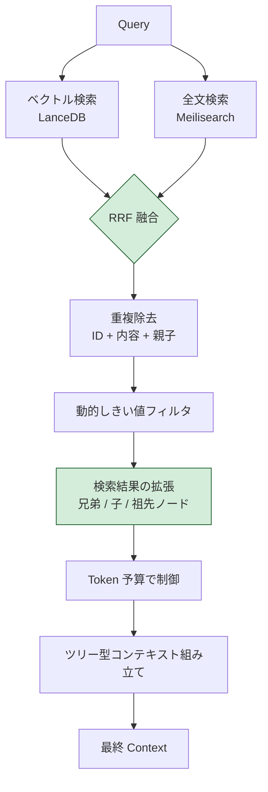
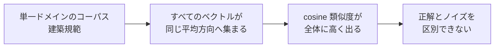

# 建築設計 AI アシスタント — RAG サブシステム紹介

> 対象範囲：**RAG サブシステムのみ**（PPT 生成モジュールは含みません）
> 私の役割：RAG パイプライン全体の実質的なオーナー（フロー設計 + 精度改善）

---

## 一、1ページで分かる概要

| 項目 | 内容 |
|---|---|
| **プロダクト** | 建築設計向けの総合 AI アシスタント。対話シーンでは質問の種類に応じて自動で RAG を有効化 |
| **RAG の発火場面** | ① 類似事例の推薦 ② 建築基準・規範 ③ その他の専門知識 — 3 種類の質問をそれぞれ対応するナレッジベースにルーティング |
| **私の役割** | チームメンバー。全体フレームワークは外部委託側が担当し、**RAG モジュールは私が全面的に書き直して主導** |
| **主な成果** | 比較実験により、ベクトル検索の TOP5 ヒット率を **4% から 96% に改善**。Hybrid TOP1 正答率は **60% から 100% に改善** |
| **担当範囲** | PDF→Markdown、LLM による構造化補助、チャンク分割戦略、登録前フィルタ、Embedding 選定、Hybrid 検索の調整、コンテキスト組み立て |
| **現在進めていること** | 体系的な評価基盤の整備（正解付き評価セット + 自動回帰テスト） |

---

## 二、業務背景と課題

### 2.1 プロダクトの位置付け
建築設計者は、提案作成、報告、顧客対応の過程で大量の専門知識検索を必要とする。本システムは社内向けの「建築設計総合 AI アシスタント」で、対話画面と PPT 生成画面の 2 つの入口を持つ。

### 2.2 対話内での RAG の発火
対話シーンでは、システムがユーザー意図を判定し、以下の 3 種類に該当した場合に RAG を有効化する。

- **類似事例の推薦**：過去のプロジェクト事例集から近い設計案を検索
- **建築基準・規範**：GB / JGJ / TB 系列の規範条文を検索
- **その他の専門知識**：材料、工法、構法など

質問の種類ごとに対応するナレッジベースへルーティングし、分野横断のノイズを避ける。

### 2.3 このシーン特有の難しさ

| 課題 | 影響 |
|---|---|
| **長大な PDF + 多数の表 / 画像** | 表が画像として保存されていることが多く、BM25 でもベクトル検索でも表内の数値を取得できない |
| **専門用語 + 規範番号**（例：GB 50108-2008） | 汎用 embedding は番号の識別が弱く、意味が近い別規範を取り違えやすい |
| **単一ドメインのコーパス** | 後述する「ベクトル空間の異方性」の問題が特に出やすい |
| **回答には正確さと根拠が必須** | 設計者は条文を引用するため、「だいたい合っている」回答では不十分。ハルシネーションは許容できない |

---

## 三、私の役割と責任範囲

| 区分 | 範囲 |
|---|---|
| **Owner（主担当）** | RAG パイプライン全体：PDF→Markdown、LLM によるクリーニング補助、チャンク分割戦略、登録前フィルタ、Embedding モデル選定、検索ロジック、コンテキスト組み立て、評価 |
| **実装・デバッグが可能** | LLM モジュールの呼び出しオーケストレーション、SSE ストリーミング、検索と生成の接続部分の結合調整 |
| **概要を説明できる** | デプロイ運用、フロントエンド、PPT モジュール（他メンバーが担当） |

> プロジェクト全体のフレームワークは外部委託チームが構築し、**RAG モジュールはほぼ私が書き直して継続的に改善**した。

---

## 四、システム構成の全体像

**技術スタック**：FastAPI（async）+ SQLAlchemy 2.0 + MySQL + **LanceDB**（ベクトル）+ **Meilisearch**（全文）+ Redis（キャッシュ / レート制御）+ Qwen text-embedding-v4（embedding）+ Qwen-plus（生成）。

---

## 五、RAG データ処理パイプライン

### 5.1 パイプライン全体

### 5.2 重要なステップ

#### Step 1 · PDF → Markdown
建築規範の文書は長大な PDF が多く、そのままベクトル化しても精度が出にくい。まず Markdown に変換して章・節・条の階層（`# / ##` など）を保持し、後段の構造ベースの分割に使う。

#### Step 2 · LLM による構造化と要約の補助
- LLM で変換結果を再クリーニングし、章番号の修正、条文説明の階層補完、ヘッダー / フッターのノイズ除去を行う
- 各章に短い要約を付け、chunk のメタデータとして検索を補助する

単純な PDF→MD 変換では番号階層が崩れやすく（「3.2.1」が通常段落として扱われることがある）、LLM を使うと前後文脈から構造を復元できる。

#### Step 3 · ツリー構造でのチャンク分割
Markdown の見出し階層から TreeNode を構築し、実体化したパス `0001/0002/0003` で親子関係を保持する。これにより、検索時に兄弟ノードや子ノードへ拡張できる。

#### Step 4 · 登録前フィルタ（反復の中で見つけた改善）
**問題の発見**：テスト中、検索結果に「3.2.1」「概要」のような見出しだけの chunk や、十数文字しかない極端に短い chunk が何度も出てきた。top_k を消費するだけで、回答には寄与しない。

**診断**：
- 分割器が短い章から見出しだけの chunk を生成していた
- 表が細かく分断され、大量の断片ができていた
- 一部の文書には長い英数字識別子だけのブロックがあった

**対応**：embedding 登録前にフィルタ層を追加し、次の条件に当てはまる chunk を除外した。
- 内容長がしきい値未満
- 見出し、番号、英字 token のみで構成される
- 情報密度が低い（文字の繰り返し率が高い）

**効果**：top_k を本当に中身のある chunk に使えるようになり、検索の質が明確に向上した。

#### Step 5 · 二重インデックス
同じ chunk を LanceDB（ベクトル）と Meilisearch（全文）の両方に登録し、後段の Hybrid 検索の土台にした。

---

## 六、RAG 検索パイプライン

### 6.1 検索フロー

### 6.2 重要な設計とトレードオフ

| 設計ポイント | 採用方式 | トレードオフ |
|---|---|---|
| **Hybrid 検索** | ベクトル + 全文の RRF 融合 | ベクトルは意味に強く、全文検索は用語に強い（「GB 50108」は必ず拾いたい）。RRF はスコア尺度に依存せず、重み付き方式より安定 |
| **検索結果の拡張** | ヒット後に兄弟 / 子ノードを追加取得 | 「3.2.1 防火等級」がヒットしたら、3.2.2、3.2.3 と親節「3.2 防火設計」も自動で付けるため、回答がより完全になる。代わりにコンテキストは長くなるが、Token Limiter で制御する |
| **3段階の重複除去** | ID / 内容類似度 / 親子関係 | Hybrid では親ノードと子ノードが同時にコンテキストへ入りやすく、冗長になりやすい |
| **動的しきい値** | 現在のクエリのスコア分布に応じて適応 | 固定しきい値はクエリごとの差が大きく、「厳しすぎて取りこぼす / 緩すぎてノイズが増える」という両立しにくい問題がある |
| **chunk 数より token 予算を優先** | token 数でコンテキスト長を制御 | LLM の制約は token ベースであり、chunk 数だけでは正確に制御できない |
| **ツリー型コンテキスト組み立て** | 連結時に見出しパスを保持 | LLM が出典の正確性を判断しやすくなり、回答時に「『xxx規範』3.2.1」のような形で根拠を示せる |

---

## 七、主要ケース — Embedding モデル選定実験

> 「問題の発見 → 根本原因の診断 → 比較実験 → 意思決定と実装」までを一通り示せるケース。

### 7.1 背景
本番初期版では **doubao-embedding-large-text-250515**（2048 次元）を使用していた。テストの結果、規範系クエリの cosine スコアがすべて **0.87 〜 0.92** に偏って高く、正しい chunk と無関係な chunk の差がほぼ出なかった。しきい値を上げると取りこぼし、下げるとノイズが急増する状態だった。

### 7.2 根本原因の診断 — ベクトル空間の異方性

学術的には **anisotropy** と呼ばれる。狭いドメインのコーパスでは、embedding モデルが出力するベクトルが等方的に分布せず、特定方向に偏って集まるため、cosine 距離の識別力が落ちる。

### 7.3 試した対応 — All-but-the-Top 後処理
**方法**：ベクトルの先頭 N 個の主成分（PCA）を除去し、支配的な方向を打ち消す。

**結果**：絶対スコアは 0.87 から 0.30 前後まで下がり、一見まともに見えたが、**Score Spread（正解 chunk のスコア − TOP1 ノイズのスコア）がほぼ 0** のままで、順位付けの意味がなかった。しきい値を下げると適合率は崩れた。

**結論**：AbTT は緩和策にはなるが、識別力そのものは作れない。

### 7.4 最終案 — Qwen text-embedding-v4 へ切り替え
1024 次元。ベクトル空間がもともと等方的で、**後処理なし**で使えた。

### 7.5 比較実験の結果

正解文書が既知の建築規範系クエリ 5 問で比較。top_k=5、threshold=0.0、RRF(0.7/0.3) を固定。

| 指標 | Doubao + AbTT | Qwen v4 |
|---|---|---|
| ベクトル TOP5 ヒット数（満点 25） | **1 / 25 (4%)** | **24 / 25 (96%)** |
| Hybrid TOP1 正答率（満点 5） | 3 / 5 (60%) | **5 / 5 (100%)** |
| Score Spread | ≈ 0 | > +0.5 |
| 後処理の要否 | 必須 | 不要 |
| LLM のエンドツーエンド回答正答率 | N/A | **5 / 5** |

### 7.6 ここで整理した方法論
後続の embedding 選定向けに、次の評価手順を標準化した。

- **Score Spread 指標**（正解 chunk と TOP1 ノイズのスコア差）を定義し、単純なヒット率だけに頼らない
- 3 層で観察する。ベクトル単独 / 全文単独 / Hybrid のそれぞれで挙動を見る
- LLM の回答まで含めてエンドツーエンドで確認し、「検索は良いが回答は間違う」という見かけの指標を避ける

---

## 八、私の具体的な貢献

| 領域 | 実施内容 |
|---|---|
| **データ処理** | PDF→Markdown パイプラインの設計、LLM による章構造化と要約生成 |
| **チャンク分割戦略** | ツリー構造の分割器、登録前の短い塊 / 見出しのみの塊を除外するフィルタ層（反復の中で発見して改善） |
| **Embedding 選定** | 比較実験の設計、Score Spread 指標の定義、異方性の診断、Doubao から Qwen v4 への切り替え |
| **検索ロジック** | Hybrid 検索 + RRF 融合の調整、検索結果拡張の実装、コンテキスト組み立ての再設計（ツリー構造 + 見出しパス） |
| **検索パラメータ調整** | top_k、threshold、融合重みをナレッジベースごとに最適化 |
| **効果検証** | 正解付き評価セットの設計、「検索 → コンテキスト → LLM 回答」のエンドツーエンド評価 |
| **結合調整と障害対応** | モジュール横断の結合調整（RAG → LLM）、バグの特定と修正 |

---

## 九、現状の限界と次の改善

### 9.1 評価基盤の不足（最優先の改善項目）
**現状**：

- 正解付き評価問題が 5 問しかなく、統計的に弱い
- 評価は「LLM 判定 + 人手の確認」に依存しており、RAGAS などの標準指標を使っていない
- CI の回帰がなく、パラメータ調整後は毎回手動比較になる

**計画**：

- 正解付き評価セットを 30 問以上まで拡張し、3 つの業務シーンをカバーする
- **RAGAS** 指標を導入する：faithfulness、context_precision、context_recall
- 評価をスクリプト化し、PR を契機に自動回帰を実行して、「調整 → 評価 → 判断」の閉ループを作る
- Bad Case 集を整備し、定期的に振り返る

### 9.2 表と画像に関する構造的な欠陥
**問題**：テストで見えた痛点として、一部の重要な数値が**画像の表**として保存されており、BM25 でもベクトル検索でも拾えない。

**計画**：

- PDF レイアウト解析を導入する（PP-StructureV2 / Marker / unstructured）
- OCR 後の表を Markdown として再構造化し、再登録する
- 図表には自然言語の説明を付け、補助インデックスとして使う

### 9.3 検索品質
- **Cross-Encoder での再ランキング**：Hybrid の後段で `bge-reranker-v2-m3` を使って再ランキングを行う
- **クエリ書き換え**：Multi-Query / HyDE で表現差の大きい質問を吸収する
- **ドメイン微調整**：Qwen embedding に対する建築ドメイン LoRA 微調整の ROI を評価する

### 9.4 エンジニアリング
- BackgroundTasks をバックグラウンドジョブキューに置き換え、文書処理が再起動で失われないようにする
- OpenTelemetry を導入し、search → fusion → rerank → LLM を 1 本の trace で追えるようにする
- Embedding 層をファクトリ化し、今後は KB ごとに embedder を切り替えやすくする
