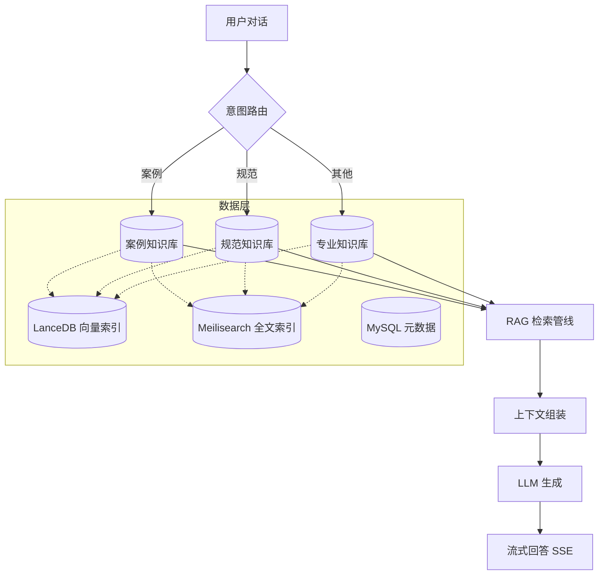
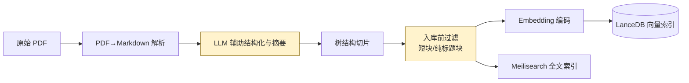
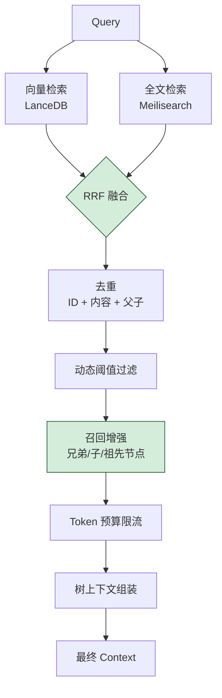
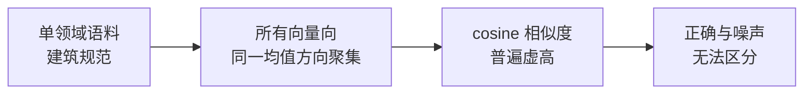

# 建筑设计 AI 助手 — RAG 子系统介绍

> 面试用屏幕分享文档 · 应聘岗位：AI Engineer（应届）
> 涵盖范围：**仅 RAG 子系统**（不含 PPT 生成模块）
> 我的角色：RAG 整条管线的实质 owner（流程设计 + 效果改进）

---

## 0. 一页速览

| 维度 | 内容 |
|---|---|
| **产品** | 建筑设计全能 AI 助手，对话场景下根据问题类型自动启用 RAG |
| **RAG 触发场景** | ① 推荐案例 ② 建筑规范 ③ 其他专业知识 — 三类问题路由到对应知识库 |
| **我的角色** | 团队成员；外包负责整体框架，**RAG 模块由我重写并主导** |
| **核心成果** | 通过对照实验把向量召回 TOP5 命中率从 **4% 提升到 96%**；Hybrid TOP1 准确率从 60% 提升到 100% |
| **覆盖工作** | PDF→Markdown、LLM 辅助结构化、切片策略、入库过滤、Embedding 选型、Hybrid 检索调参、上下文组装 |
| **当前在做** | 系统化评测体系建设（金标集 + 自动化回归） |

---

## 1. 业务背景与挑战

### 1.1 产品定位
建筑设计师在做方案、汇报、客户沟通时存在大量专业知识检索需求。本系统是公司内部的"建筑设计全能 AI 助手"，对话页面与 PPT 生成页面双入口。

### 1.2 RAG 在对话中的触发
对话场景下系统识别用户意图，命中以下三类时启用 RAG：
- **推荐案例**：从历史项目案例库召回相似设计
- **建筑规范**：查询 GB / JGJ / TB 系列规范条款
- **其他专业知识**：材料、工艺、构造做法等

每类问题路由到对应知识库，避免跨域噪声。

### 1.3 这个场景的特殊难点

| 难点 | 影响 |
|---|---|
| **长 PDF + 大量表格 / 图片** | 表格常以图片形式存储，BM25 与向量都拿不到表内数值 |
| **专业术语 + 规范编号**（如 GB 50108-2008） | 通用 embedding 对编号区分度差；语义相近的不同规范容易混淆 |
| **单领域语料** | 后面会讲到的"向量空间各向异性"问题在这里特别明显 |
| **答案要求精确可追溯** | 设计师要引用条款，不能给"差不多对"的回答；对幻觉零容忍 |

---

## 2. 我的角色与责任划界

```
        ┌─────────────────────────────────┐
        │     了解（能讲清原理与决策）       │
        │   ┌──────────────────────────┐  │
        │   │  熟悉（能改、能 debug）   │  │
        │   │  ┌──────────────────┐    │  │
        │   │  │ Owner（主导）     │    │  │
        │   │  └──────────────────┘    │  │
        │   └──────────────────────────┘  │
        └─────────────────────────────────┘
```

| 圈层 | 范围 |
|---|---|
| **Owner** | RAG 整条管线：PDF→Markdown、LLM 辅助清洗、切片策略、入库过滤、Embedding 模型选型、检索逻辑、上下文组装、效果评测 |
| **熟悉** | LLM 模块的调用编排、SSE 流式、检索-生成衔接联调 |
| **了解** | 部署运维、前端、PPT 模块（由其他成员负责） |

> 项目整体框架由外包团队搭建，**RAG 模块基本由我重写并持续迭代**。

---

## 3. 系统架构总览



**技术栈**：FastAPI（async）+ SQLAlchemy 2.0 + MySQL + **LanceDB**（向量）+ **Meilisearch**（全文）+ Redis（缓存/限流）+ Qwen text-embedding-v4（embedding）+ Qwen-plus（生成）。

---

## 4. RAG 数据处理流水线

### 4.1 流水线总览



### 4.2 关键步骤说明

#### Step 1 · PDF → Markdown
建筑规范多为长 PDF，直接做向量化效果差。先转 Markdown 保留章节层级（`# / ##` 对应规范的章/节/条），方便后续按结构切片。

#### Step 2 · LLM 辅助结构化与摘要 ★
**做了什么**：
- 用 LLM 对原始转换结果做二次清洗（修正章节编号、补全条文说明的层级、去除页眉页脚噪声）
- 为每个章节生成简短摘要，作为 chunk 元数据辅助检索

**为什么**：直接的 PDF→MD 转换会丢失编号层级（"3.2.1" 可能被识别成普通段落），LLM 能基于上下文恢复结构。

#### Step 3 · 树结构切片
按 Markdown 标题层级构建 TreeNode 树，材料化路径 `0001/0002/0003` 保留父子关系 → 检索时可做兄弟/子节点扩展。

#### Step 4 · 入库前过滤 ★（迭代发现的改进）
**问题发现**：测试时反复看到检索结果里出现"3.2.1"、"概述"这类纯标题或十几字的极短 chunk，挤占 top_k 名额且对回答无价值。

**诊断**：
- 切片器对短章节会产出仅含标题的 chunk
- 表格被切碎后产生大量碎片
- 部分文档存在长串英文标识符块

**方案**：在 embedding 入库前加一道过滤层，按以下规则丢弃：
- 内容长度 < 阈值
- 仅包含标题、编号、纯英文 token
- 信息密度过低（重复字符比例高）

**效果**：top_k 命中名额留给真正有内容的 chunk，召回质量明显提升。

#### Step 5 · 双索引
同一批 chunk 同时写入 LanceDB（向量）与 Meilisearch（全文），为后续 Hybrid 检索打基础。

---

## 5. RAG 检索流水线

### 5.1 检索流程



### 5.2 关键设计与 Trade-off

| 设计点 | 选型 | Trade-off |
|---|---|---|
| **Hybrid 检索** | 向量 + 全文 RRF 融合 | 向量擅长语义、全文擅长术语（"GB 50108"必须命中）；RRF 不依赖分数尺度，比 weighted 更稳健 |
| **召回增强** | 命中后回取兄弟 / 子节点 | 命中"3.2.1 防火等级"时自动带上 3.2.2、3.2.3 与父节"3.2 防火设计"，回答更完整；代价是上下文变长，由 Token Limiter 兜底 |
| **去重三级** | ID / 内容相似度 / 父子 | Hybrid 召回容易产生父节点+子节点同时进上下文的冗余 |
| **动态阈值** | 按当前查询的分数分布自适应 | 固定阈值在不同查询表现差异大，自适应避免"严格漏召回 / 宽松噪声多"两难 |
| **Token 预算优于条数** | 按 token 控制上下文长度 | LLM context 是 token 限制；按 chunk 数控制不准确 |
| **树状上下文组装** | 拼接时保留标题路径 | LLM 更容易判断引用准确性，回答时能带上"《xxx规范》3.2.1"这样的源 |

---

## 6. 关键案例 — Embedding 模型选型实验

> 这是我做过的最有代表性的工作之一，体现"发现问题→根因诊断→对照实验→决策落地"完整闭环。

### 6.1 背景
线上初版用 **doubao-embedding-large-text-250515**（2048 维）。测试时发现：所有规范类查询的 cosine 分数都虚高在 **0.87~0.92**，正确 chunk 与无关 chunk 的分数几乎相同，**threshold 调高漏召回，调低噪声爆炸**。

### 6.2 根因诊断 — 向量空间各向异性



学术上叫 **anisotropy**：在窄领域语料下，embedding 模型产出的向量在空间中并非各向同性分布，而是聚集到一个方向，导致 cosine 距离失去区分能力。

### 6.3 尝试方案 — All-but-the-Top 后处理
**方法**：去除向量的前 N 个主成分（PCA），消除主导方向。

**结果**：绝对分数从 0.87 降到 0.30 左右，看似合理，但 **Score Spread（正确 chunk 分数 − TOP1 噪声分数）≈ 0** — 排序完全无意义。降阈值后精确率崩溃。

**结论**：AbTT 是缓解手段，不能真正建立区分度。

### 6.4 最终方案 — 切换到 Qwen text-embedding-v4
1024 维，向量空间天然各向同性，**无需任何后处理**即可使用。

### 6.5 对照实验结果

5 道金标题（建筑规范类问题，已知正确答案文档），固定 top_k=5、threshold=0.0、RRF(0.7/0.3)：

| 指标 | Doubao + AbTT | Qwen v4 |
|---|---|---|
| 向量 TOP5 命中（满分 25） | **1 / 25 (4%)** | **24 / 25 (96%)** |
| Hybrid TOP1 准确率（满分 5） | 3 / 5 (60%) | **5 / 5 (100%)** |
| Score Spread | ≈ 0 | > +0.5 |
| 是否需要后处理 | 必须 | 不需要 |
| LLM 端到端回答准确率 | N/A | **5 / 5** |

### 6.6 沉淀的方法论
为后续 embedding 选型固化了一套评测套路：
- 自定义 **Score Spread 指标**（正确 chunk 与 TOP1 噪声的分数差）替代单纯的命中率
- 三层观察：纯向量 / 纯全文 / Hybrid，分别看模型在不同路径的表现
- 端到端跑通 LLM 回答，避免"召回好但答不对"的伪指标

> 详细过程见 [RAG_EMBEDDING_COMPARE_PLAN.md](../../RAG_EMBEDDING_COMPARE_PLAN.md) 与 [RAG_EMBEDDING_COMPARE_RESULT.md](../../RAG_EMBEDDING_COMPARE_RESULT.md)

---

## 7. 我的具体贡献清单

| 方向 | 我做了什么 |
|---|---|
| **数据处理** | PDF→Markdown 流水线设计；LLM 辅助章节结构化与摘要生成 |
| **切片策略** | 树结构切片器；入库前短块/标题块过滤层（迭代发现并修复） |
| **Embedding 选型** | 设计对照实验；定义 Score Spread 指标；诊断各向异性问题；从 Doubao 切换到 Qwen v4 |
| **检索逻辑** | Hybrid 检索 + RRF 融合调参；召回增强策略落地；上下文组装重构（树结构 + 标题路径） |
| **检索调参** | top_k、threshold、融合权重在不同 KB 上的调优 |
| **效果评测** | 设计金标题集；端到端跑通"召回 → 上下文 → LLM 回答"全链路评估 |
| **联调与排障** | 跨模块联调（RAG → LLM）；Bug 定位与修复 |

---

## 8. 当前局限与下一步改进

> 主动暴露不足、给出可执行计划，比假装完美更能体现工程成熟度。

### 8.1 评测体系不足（首要改进）
**现状**：
- 金标题仅 5 道，统计意义有限
- 评估靠"LLM 判断 + 人工兜底"，未引入 RAGAS 等标准化指标
- 没有 CI 回归机制，调参后只能跑一次手工对比

**计划**：
- 扩充金标集到 30+ 题，覆盖三类业务场景
- 引入 **RAGAS** 指标：faithfulness、context_precision、context_recall
- 把评测脚本化，PR 触发自动跑回归，建立"调参 → 评测 → 决策"闭环
- 沉淀 Bad Case 库，定期复盘

### 8.2 表格与图片的结构性缺陷
**问题**：测试中 Q3（锅炉房防火间距）暴露了痛点 — 关键数值以**图片表格**形式存储，BM25 和向量都检索不到。

**计划**：
- 引入 PDF 布局解析（PP-StructureV2 / Marker / unstructured）
- 表格 OCR 后结构化为 Markdown 重新入库
- 图表生成自然语言描述作为辅助索引

### 8.3 检索召回质量
- **Cross-Encoder 重排**：在 Hybrid 后引入 `bge-reranker-v2-m3` 做精排
- **查询改写**：Multi-Query / HyDE 处理表述差异大的问题
- **领域微调**：评估对 Qwen embedding 做建筑领域 LoRA 微调的 ROI

### 8.4 工程化
- 后台任务队列替换 BackgroundTasks（文档处理重启不丢）
- OpenTelemetry 接入，把 search → fusion → rerank → LLM 串成单条 trace
- 嵌入层抽象为工厂，方便后续按 KB 切换 embedder

---

## 9. 常见追问预案（自用提示）

| 追问 | 简答方向 |
|---|---|
| 为什么用 LanceDB 不用 Qdrant / Milvus？ | 团队规模小、无运维资源；嵌入式部署 + Arrow 列式足够支撑当前规模；已有抽象意识，未来可换 |
| RRF 和 weighted 怎么选？ | 分数尺度难统一时 RRF 稳；分数有意义且能调权时 weighted 灵活。我们选 RRF 因为向量与 BM25 分数量纲完全不同 |
| 各向异性问题为什么不直接用领域微调解决？ | 短期 ROI 低（微调要标注数据 + 训练资源 + 评测框架）；换模型成本最低且效果立竿见影。微调是中期备选 |
| 切片大小怎么定的？ | 主要按章节自然边界，超长章节再按 token 二次切；阈值靠端到端跑测试题反复调出来的，没有理论最优 |
| 怎么处理"案例 / 规范 / 其他"路由判断？ | 上层意图识别（关键词 + LLM 判定结合），命中后路由到对应 KB；这部分由对话编排负责，不在 RAG 模块内 |
| 现在的评测样本只有 5 题，怎么保证泛化？ | 坦诚承认这是当前最大短板（见 8.1）；解释下一步计划；强调 5 题虽小但覆盖了三类典型场景，结论的方向性可信 |
| 为什么不用 LangChain / LlamaIndex？ | 团队评估后认为对当前规模过重；自研更可控、调试更容易；理解其高级 RAG 模式（Parent-Document、Multi-Query 等）并选择性借鉴 |
| 你最大的成长是什么？ | 从"凭感觉调参"到"对照实验 + 指标驱动"的工程思维转变；以 embedding 选型为标志性事件 |

---

## 10. 屏幕分享讲解节奏建议（10 分钟版）

| 时间 | 内容 |
|---|---|
| 0:00–1:00 | 第 0 节速览（让面试官 30 秒抓到核心数字） |
| 1:00–2:30 | 第 1–2 节业务背景 + 角色划界 |
| 2:30–4:00 | 第 3 节系统架构图走查 |
| 4:00–6:00 | 第 4 节数据处理流水线，重点讲"入库前过滤"小故事 |
| 6:00–7:30 | 第 5 节检索流水线 + Trade-off 表 |
| 7:30–9:00 | 第 6 节 Embedding 选型案例（重点讲根因诊断与方法论） |
| 9:00–10:00 | 第 8 节当前局限与改进方向（展示前瞻性，邀请提问） |

---

## 11. 附录：相关文档索引

- 系统架构：[../01-architecture-zh.md](../01-architecture-zh.md)
- RAG 模块详情：[../04-rag-module-zh.md](../04-rag-module-zh.md)
- Embedding 对比实验计划：[../../RAG_EMBEDDING_COMPARE_PLAN.md](../../RAG_EMBEDDING_COMPARE_PLAN.md)
- Embedding 对比实验结果：[../../RAG_EMBEDDING_COMPARE_RESULT.md](../../RAG_EMBEDDING_COMPARE_RESULT.md)
- 测试报告：[../test-results-20260306.md](../test-results-20260306.md)
- 改进方向（完整版）：[../11-改进方向.md](../11-改进方向.md)
